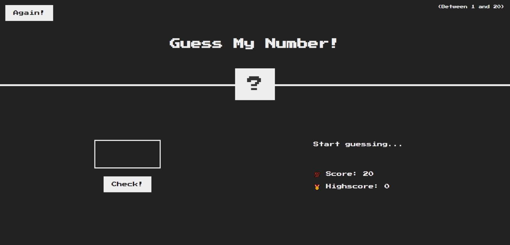

# Guess My Number - Web Game

Welcome to the "Guess My Number" web game repository! This project is an interactive web game where players can try to guess a randomly generated number within a specified range.

## Play the Game

You can play the game right now by visiting the following link: [Guess My Number](https://guess-my-numberweb.netlify.app/)

## How to Play

1. Click the game link above to open the web page.
2. Enter your guess in the input field.
3. Click the "Check" button to see if your guess matches the secret number.
4. The game will provide feedback, letting you know if your guess is too high or too low.
5. Keep guessing until you correctly guess the number, and you win!

## Features

- Randomly generated secret number.
- Feedback on each guess.
